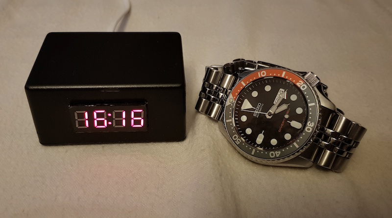

# ESP8266 based small NTP clock



## Features
- 24 hour time display
- NTP sync
- DST support (automatic change)
- Configurable over WiFiManager softAP config
- OTA upgradable firmware

## Prerequisites
- ESP8266 board (recommended: NodeMCU/compatible see BOM)
- TM1637 4 digit 7 segment display 
- [PlatformIO](https://platformio.org)

## Build & Installation HOWTO

### Hardware BOM

- [NodeMCU v3 board](http://www.banggood.com/Geekcreit-Doit-NodeMcu-Lua-ESP8266-ESP-12E-WIFI-Development-Board-p-985891.html)
- TM1637 4 digit 7 segment display with colon
- Female-female dupont cable 4pcs (usually comes with the display)

### Wiring between NodeMCU and TM1637 display board

```
NodeMCU 3.3V -> Display Vcc
NodeMCU GND  -> Display GND
NodeMCU D3   -> Display CLK
NodeMCU D4   -> Display DIO
```

### Software installation

- Download and install [PlatformIO](https://platformio.org)
- Optionally read https://docs.platformio.org/en/latest/quickstart.html

PlatformIO automatically downloads all required libraries, boards, and configures your environment.

### Uploading

PlatformIO serial
```
platformio run --target upload
```

PlatformIO OTA
```
platformio run -t upload --upload-port <IP address of ESP>
```

### WiFi Configuration

If unable to connect to a known WiFi AP, the unit will come up in configuration mode. Connect your PC/smartphone to SSID "clockAP" and follow captive portal UI to configure your WiFi credentials. Upon successful connnection to your WiFi, clock will remember credentials.

## Future plans

- Force configuration mode (button/jumper, etc)
- Openweathermap (?)

## Special thanks

- [William Moeur](https://github.com/moeur) for NTP code improvements and credentials config

